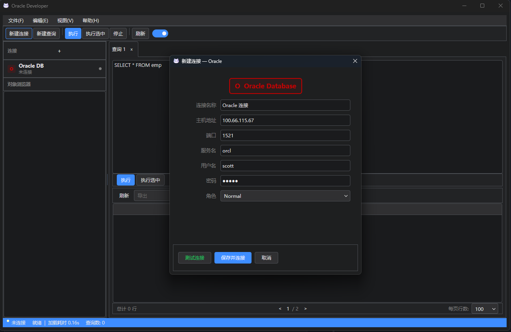
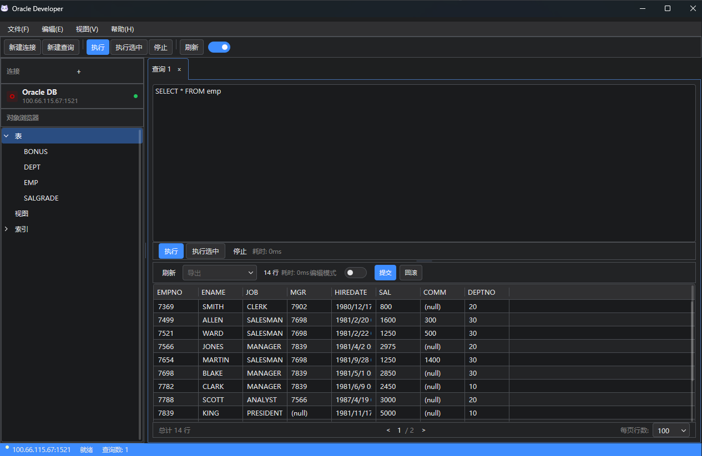

# OracleClient

> 面向 Oracle 工作流的原生桌面客户端。  
> 为更快的连接、更直接的查询反馈、更现代的桌面体验而构建。

**一个更轻、更快、更聚焦 Oracle 的桌面数据库工作台。**

[](../../releases/latest)
[](../../releases)

**支持平台**


**最新发布**

[](../../releases/latest)

**AOT**


**Oracle**


## 下载说明

把这里当作仓库首页的快速下载区即可：

- 想直接体验项目：进入 [下载最新版本](../../releases/latest)
- 想查看历史版本或不同平台资产：进入 [全部 Release](../../releases)
- 下载后想校验完整性：在最新 Release 中同时获取 `SHA256SUMS.txt`
- 当前发布资产按平台分别打包，选择与你系统对应的 `win-x64`、`linux-x64` 或 `osx-arm64` 文件即可



## 项目简介

`OracleClient` 是一个基于 `MewUI` 构建的 Oracle 数据库管理客户端，目标不是再做一个“功能堆砌的大而全工具”，而是提供一个更轻、更快、更贴近桌面交互体验的 Oracle 工作台。

如果你常常需要在 Oracle 上做这些事情：

- 频繁连接不同环境，快速验证连接状态
- 打开查询标签页，直接执行 SQL 看结果
- 浏览表、视图、索引等对象结构
- 希望客户端界面更现代、反馈更直接、启动更轻巧

那么这个项目就是为这样的使用场景而生。

## 为什么做这个项目

很多数据库工具都很强大，但也常常伴随着这些体验问题：

- 启动重，等待长，桌面交互不够流畅
- 通用型设计偏多，对 Oracle 场景不够聚焦
- 界面层级复杂，日常查询和对象浏览的路径过长
- 很难作为一个“现代原生桌面 UI + Oracle 客户端”示例项目来学习和扩展

`OracleClient` 想解决的，不只是“能不能连上数据库”，而是：

- 能不能让 Oracle 的日常操作更顺手
- 能不能把原生桌面体验做得更干净
- 能不能作为 `MewUI` 在数据库客户端方向上的一个可见样板

## 适合谁

- 需要 Oracle 查询和对象浏览能力的开发者
- 想做内部数据库工具、运维辅助工具的团队
- 对 `MewUI + .NET 9 + 原生桌面` 组合感兴趣的开发者
- 希望围绕 Oracle 客户端场景继续扩展功能的贡献者

## 当前亮点

### 1. 面向 Oracle 的桌面工作流

项目当前已经具备一个完整的客户端雏形，围绕 Oracle 场景提供了较清晰的主工作流：

- 新建连接与测试连接
- SQL 查询标签页管理
- 查询执行与结果展示
- 对象浏览器树
- 状态栏与 Toast 即时反馈
- 暗色 / 亮色主题切换

### 2. 更现代的原生 UI 组织方式

当前界面已经包含较完整的桌面布局能力：

- 顶部菜单栏与工具栏
- 左侧连接卡片与对象浏览区
- 中央查询标签页与编辑器
- 下方结果区、分页区、状态栏
- 多处交互反馈与弹窗对话框

这让它不仅是一个工具，也具备作为 UI 样板项目继续演进的价值。

### 3. 结果展示不是简单文本回显

项目已支持基于查询结果动态生成结果表格列：

- 自动生成 `GridView` 列头
- 按字段映射每一行数据
- 支持斑马纹、网格线、滚动区域
- 预留导出入口与编辑模式入口

对于一个数据库客户端来说，这意味着它已经跨过了“只演示连接”的阶段，开始具备真实使用价值。

### 4. 多平台发布思路已经具备

项目当前配置了基于 GitHub Actions 的构建与发布流程，目标平台包括：

- `win-x64`
- `linux-x64`
- `osx-arm64`

同时项目使用：

- `.NET 9`
- `PublishAot=true`
- `TrimMode=full`

这代表它不仅在做界面，也在探索更轻量、更偏交付型的桌面应用发布方式。

## 当前已实现能力

基于当前代码，项目已经具备以下功能模块：

### 连接管理

- Oracle 连接对话框
- 测试连接
- 保存并连接
- 连接状态展示

### SQL 查询体验

- 默认查询标签页
- 多标签打开 / 关闭
- SQL 编辑器
- 执行查询
- 执行结果反馈

### 结果展示

- 动态结果列
- 表格结果视图
- 行数与分页信息展示
- 导出菜单入口

### 对象浏览

- 读取 Oracle Schema 对象
- 展示表、视图、索引分类
- 双击 / 选择节点联动查询体验

### 界面与交互

- 菜单栏
- 工具栏
- 状态栏
- 关于窗口
- Toast 通知
- 主题切换

## 技术栈

- `C#`
- `.NET 9`
- `MewUI`
- `Oracle.ManagedDataAccess.Core`
- GitHub Actions 自动构建发布

## 项目定位

`OracleClient` 当前更适合被理解为：

1. 一个正在成型的 Oracle 原生桌面客户端
2. 一个展示 `MewUI` 在工具型应用上的实践样板
3. 一个可继续扩展为内部数据库工具或开源产品的基础项目

它已经能表达出明确的产品方向，但仍然处在持续打磨阶段。

## 当前状态

目前项目已经具备可演示、可继续开发的基础框架，但仍然不是“功能完全体”。

更准确地说，它现在处于这样的阶段：

- 已有清晰的产品界面骨架
- 已有 Oracle 连接与查询主流程
- 已有对象树和结果网格等关键模块
- 适合展示、迭代、重构和继续拓展
- 仍有进一步完善稳定性、连接复用、对象交互、导出与编辑能力的空间

## 路线图

接下来很适合继续推进这些方向：

- 完善对象浏览器交互，支持查看更多对象详情
- 强化查询体验，如执行选中、快捷键、历史记录
- 增强结果网格能力，如编辑、提交、筛选与复制
- 优化连接管理、错误处理与状态同步
- 补充截图、示例数据与更完整的发布说明
- 打磨成更适合对外展示的数据库桌面产品样板

## 快速开始

### 环境要求

- `.NET SDK 9.0`
- 可访问的 Oracle 数据库实例

### 本地运行

```bash
dotnet restore
dotnet build
dotnet run
```

### 发布

```bash
dotnet publish -c Release
```

项目仓库中也已经包含 GitHub Actions 工作流，可用于多平台构建与发布。

## 这个项目值得被更多人看到的原因

因为它不只是一个“数据库连接 Demo”。

它把几个很有意思的方向放在了一起：

- Oracle 实际使用场景
- 原生桌面 UI 体验
- `MewUI` 的工程化实践
- `.NET 9 + AOT` 的交付潜力

如果你关注这些主题，这个项目值得收藏、围观，甚至一起把它继续打磨下去。

## 参与方式

如果你也对这个方向感兴趣，欢迎通过这些方式参与：

- 提交 Issue，反馈体验问题和功能建议
- 提交 PR，完善功能与文档
- 分享给对 Oracle、桌面工具、MewUI 感兴趣的朋友
- 基于这个项目继续做你自己的数据库客户端或内部工具

## 截图

### 连接对话框


### 主界面



## 一句话总结

`OracleClient` 想做的，是一个更现代、更轻量、更适合 Oracle 工作流的原生桌面客户端。

如果你也觉得数据库工具不该只有“能用”，而应该同时具备体验、速度和扩展性，那这个项目正值得继续被做下去。
